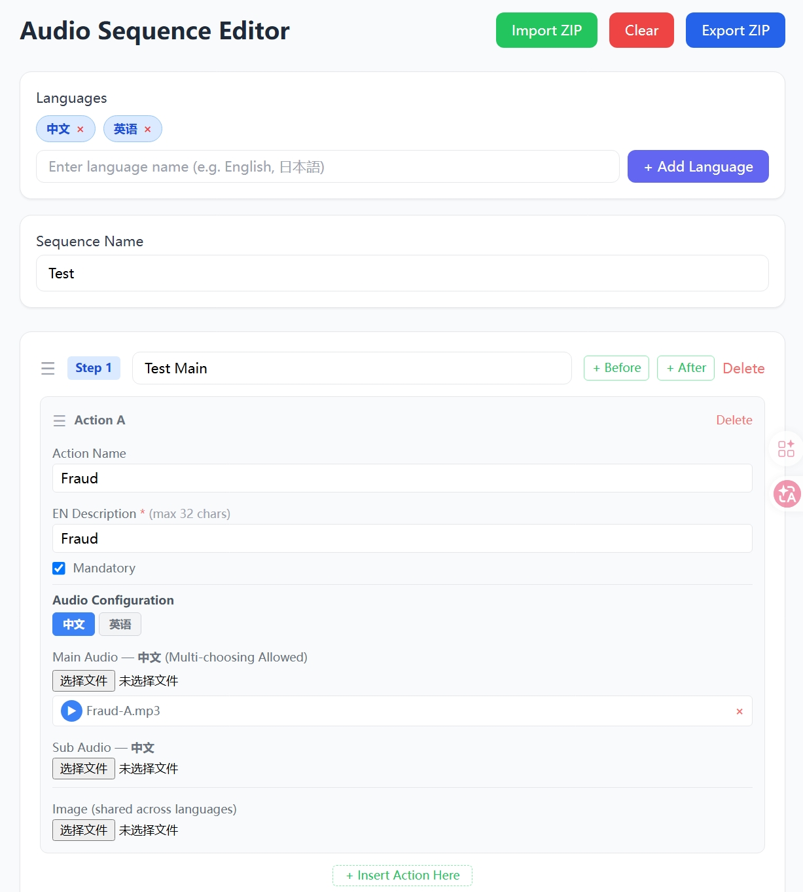

# Audio-Sequence-Editor

Couple with Audio Panel to deliver highly interaction experience. 

## Prepare your first run

Install the required libraries using the following command. 

```bash
python -m pip install -r requirements.txt
```

## Run it

Open cmd or terminal, navigate to the path where you put these files. 

Then run the following. 

```bash
python server.py
```

It will show the following lines, meaning that you've successfully run it on your computer. 

```plaintext
 * Serving Flask app 'server'
 * Debug mode: on
WARNING: This is a development server. Do not use it in a production deployment. Use a production WSGI server instead.
 * Running on http://127.0.0.1:6532
Press CTRL+C to quit
 * Restarting with stat
 * Debugger is active!
 * Debugger PIN: ***-***-***
```

Visit `localhost:6532` using your web browser. 



`6532` is the port number where the client serves, you can modify the last line in `server.py`. 

```python
app.run(debug=True, port=6532)
```
